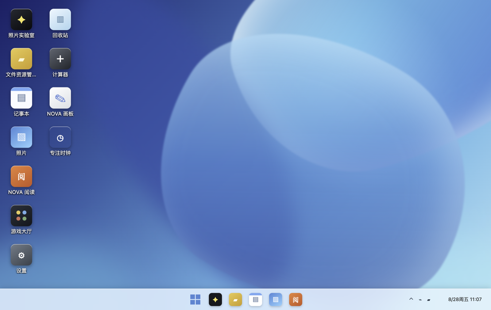
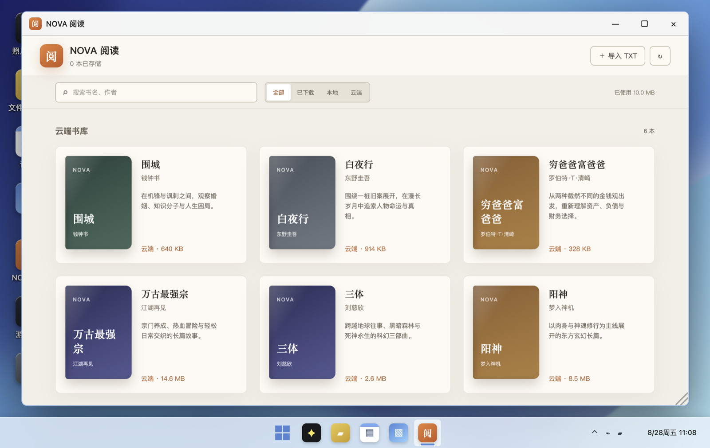
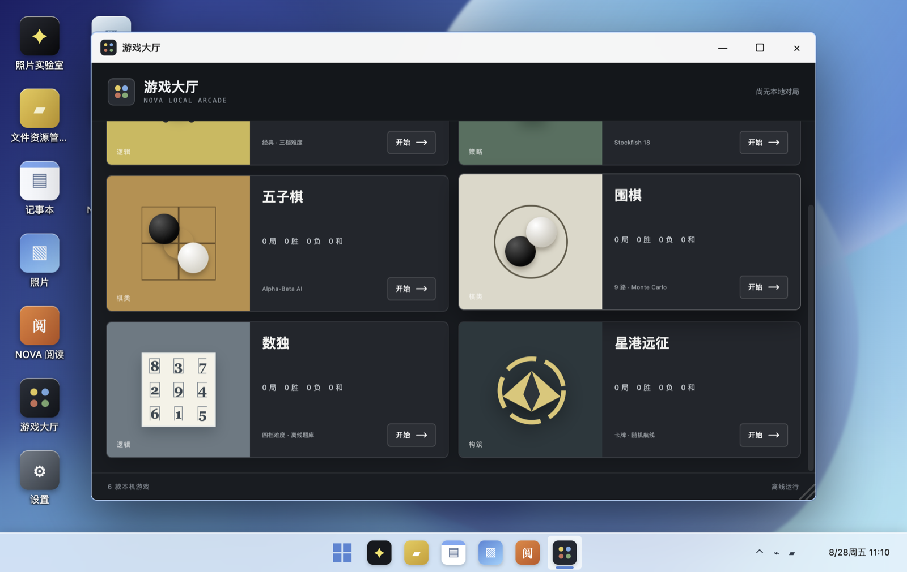

# NOVA 超级桌面

一个运行在浏览器中的本地优先创意桌面。

NOVA 不是传统的门户页或应用列表，而是一套完整的桌面工作环境：应用和文件直接出现在桌面上，窗口可以移动、缩放、贴靠、最小化和恢复，任务栏负责管理正在运行的应用。阅读、图片处理、笔记、文件管理和本机游戏共享同一套本地文件与窗口系统。

[在线体验](https://nova-super-desktop.vercel.app/)



## 设计目标

- **像桌面系统一样工作**：保留桌面图标、开始菜单、任务栏、窗口层级和右键菜单等熟悉的空间逻辑。
- **数据留在当前设备**：桌面文件、离线书籍、阅读进度、游戏存档和设置均保存在浏览器本地。
- **应用之间可以协作**：文件不是某个应用的私有副本，而是由桌面统一管理并按类型交给对应工具。
- **断网仍可使用**：通过 PWA 与 Service Worker 缓存应用壳和核心资源。
- **保持轻量**：没有账号系统、云同步服务或不可见的后台任务。

## 核心体验

### 桌面与窗口系统

- 从桌面图标、开始菜单或任务栏启动应用。
- 支持窗口拖动、缩放、最小化、最大化、关闭和焦点层级。
- 支持左右半屏、四角等六种贴靠布局，并可通过窗口按钮或快捷键触发。
- `Alt + Tab` 在运行中的窗口间切换。
- 开始菜单可统一搜索应用、桌面文件、书籍和设置，并直接定位目标。
- 任务栏展示运行状态、窗口预览、日期与通知中心；全屏应用下支持底部热区唤出。
- 支持明亮、深色、跟随系统三种主题，以及可调节的桌面反馈音效。

### 本地文件系统

桌面、文件资源管理器、记事本、照片查看器和照片实验室共享同一份 `DesktopItem` 数据。

- 文件夹、文本和图片三类桌面项目。
- 多选、范围选择、框选、复制、剪切、粘贴和跨视图拖放。
- 重名冲突时可选择替换或保留两份。
- 支持新建、重命名、删除、回收站还原和永久删除。
- 文件操作带撤销能力，批量操作同样进入撤销记录。
- 可从设备导入图片和 TXT 文本，也可以将文件直接拖到桌面。
- 本地备份支持导出为 JSON、恢复前预览和确认覆盖。

### 跨应用工作流

- 文本文件可直接进入记事本编辑，修改会实时写回桌面文件。
- 图片可在照片查看器与照片实验室之间流转。
- 照片实验室完成编辑后可覆盖原图或另存副本到桌面。
- 阅读器中的选中文段可以生成桌面文稿，并自动交给记事本继续整理。
- 文件资源管理器通过“打开方式”将文件交给合适的应用处理。

## 内置应用

| 应用 | 能力 |
| --- | --- |
| 文件资源管理器 | 文件夹导航、搜索、多选、剪贴板、拖放、属性、冲突处理与撤销 |
| 记事本 | 编辑桌面文本文件、搜索文稿、实时保存 |
| 照片 / 照片实验室 | 图片查看、调色、滤镜、裁剪、缩放、撤销与导出 |
| NOVA 阅读 | 书库、TXT 导入、离线下载、章节解析、书内搜索、书签与阅读进度 |
| NOVA 画板 | 浏览器画布绘制并将结果保存回桌面 |
| 专注时钟 | 番茄钟、倒计时、秒表、计次与本地专注统计 |
| 计算器 | 桌面内快速计算工具 |
| 设置 | 主题、音量、本地数据清理、备份导入与导出 |
| 回收站 | 批量还原、永久删除和路径恢复 |

## NOVA 阅读

阅读器同时支持内置书库和用户导入的 TXT 文件。下载后的正文存入 IndexedDB，可在离线状态下继续阅读。

- 书架搜索与本地、已下载、云端分类。
- 自动章节识别和大文本 Worker 解析。
- 上下滚动与左右翻页两种阅读方式。
- 纸张、护眼、夜间主题，以及字号、行距和翻页动画设置。
- 阅读进度、最近阅读、书签和书内全文搜索。
- 沉浸阅读与摘录到记事本。



## 游戏大厅

游戏大厅收录六款可离线运行的本机游戏，并通过统一存储层保存进度与战绩。

| 游戏 | 特点 |
| --- | --- |
| 扫雷 | 三档难度与最佳成绩 |
| 国际象棋 | Stockfish 18、计时模式、PGN 导入导出 |
| 五子棋 | Alpha-Beta AI |
| 围棋 | 9 路棋盘与 Monte Carlo AI |
| 数独 | 四档难度、笔记、提示、暂停和存档 |
| 星港远征 | 程序化航线、卡组构筑、随机事件与可复现种子 |



## 常用快捷键

| 快捷键 | 操作 |
| --- | --- |
| `Ctrl + Space` | 打开或关闭开始菜单与全局搜索 |
| `Alt + Tab` | 切换运行中的窗口 |
| `Win/Command + 方向键` | 贴靠、最大化、还原或最小化当前窗口 |
| `Alt + F4` | 关闭当前窗口 |
| `Ctrl/Command + A` | 在文件资源管理器中全选 |
| `Ctrl/Command + C/X/V` | 复制、剪切、粘贴文件 |
| `Ctrl/Command + Z` | 撤销最近一次文件操作 |
| `F2` | 重命名选中的桌面或资源管理器项目 |
| `Delete` | 将选中的项目移入回收站 |

## 本地数据与隐私

NOVA 默认不上传用户文件，也不依赖账号或远程数据库。

| 数据 | 存储位置 |
| --- | --- |
| 桌面文件与文件夹 | IndexedDB `nova-desktop` |
| 离线书籍与书架索引 | IndexedDB `nova-reader-library` |
| 主题、窗口布局、阅读进度、游戏记录 | `localStorage` 中的 `nova-*` 键 |
| PWA 应用壳与静态资源 | Cache Storage 中的 `nova-pwa-*` 缓存 |

设置中的“本地数据”会按类别展示条目数量和估算占用。用户可以单独清除桌面文件、离线书籍、游戏数据、阅读记录、专注记录、桌面设置或 PWA 缓存；所有清理操作都需要二次确认。

## PWA 与离线能力

- 提供 Web App Manifest，可从支持 PWA 的浏览器安装到桌面。
- Service Worker 缓存应用入口、拆分后的工具模块、字体、图片、Web Worker 和棋类引擎。
- 页面导航采用网络优先策略，静态资源采用缓存优先策略。
- 新版本安装完成后会在桌面内提示刷新。
- 离线状态下继续使用已缓存的桌面工具、书籍和本机游戏。

首次访问仍需要联网完成资源缓存。清除浏览器站点数据后，需要重新打开应用建立离线缓存。

## 技术栈

- React 19、TypeScript、Vite、vinext
- IndexedDB 与 [`idb`](https://github.com/jakearchibald/idb)
- Web Worker
- `chess.js` 与 Stockfish 18
- `@algorithm.ts/gomoku`
- `tenuki`
- `sudoku-gen`
- `rot-js`
- Vitest

应用模块通过 `React.lazy` 按需加载，桌面外壳只管理窗口与全局状态，各工具维护自己的编辑状态、历史记录和领域逻辑。

## 本地运行

环境要求：

- Node.js `>= 22.13.0`
- npm

```bash
git clone https://github.com/xyxiao001/nova-super-desktop.git
cd nova-super-desktop
npm install
npm run dev
```

开发服务默认运行在 [http://localhost:3000](http://localhost:3000)。

## 测试与构建

```bash
# 单元测试
npm run test:unit

# TypeScript 类型检查
npx tsc --noEmit

# vinext / Cloudflare 构建
npm run build

# Vercel 静态构建
npm run build:vercel
```

## 项目结构

```text
app/
├── page.tsx                 # 桌面外壳、窗口管理、任务栏与全局交互
├── desktopStorage.ts       # 桌面文件 IndexedDB 与增量写入队列
├── FileExplorer.tsx        # 文件资源管理器
├── ReaderApp.tsx           # 阅读器
├── PhotoEditorApp.tsx      # 照片实验室
├── GameHall.tsx            # 游戏入口与战绩
├── *Game.tsx               # 各类本机游戏
├── SettingsApp.tsx         # 个性化、本地数据与备份
└── PwaManager.tsx          # Service Worker 注册与更新提示

public/
├── manifest.webmanifest
├── sw.js
├── books/
└── stockfish/

tests/unit/                    # 文件、阅读、窗口、游戏与存储逻辑单测
docs/images/                   # README 截图
```

## 部署

仓库包含 Vercel 与 vinext/Cloudflare 两套构建入口：

- Vercel 使用 `npm run build:vercel`，输出到 `dist-vercel/`。
- vinext/Cloudflare 使用 `npm run build`，输出到 `dist/`。

当前在线版本：[nova-super-desktop.vercel.app](https://nova-super-desktop.vercel.app/)
