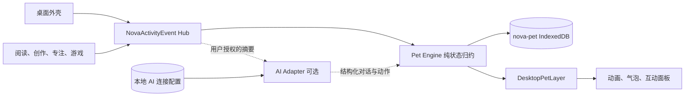

# SPEC-20260903：NOVA 桌面宠物系统

- 状态：实施中
- 提出日期：2026-09-03
- 负责人：待定
- 相关 ADR：`docs/adrs/ADR-0007-local-ai-connection-boundary.md`
- 依赖能力：桌面窗口系统、本地存储 Provider、系统时刻事件、设置应用

## 背景

NOVA 已经拥有桌面、文件、阅读器、记事本、照片实验室、画板、专注时钟和多款游戏。各应用能够保存自己的本地状态，部分应用也会向桌面发布创作完成、专注完成和游戏胜利等系统时刻，但这些反馈仍然是一次性的，应用之间缺少一个长期存在、能够理解使用轨迹的共同角色。

本项目主要供单人使用。桌面宠物的价值不是签到、付费养成或提高留存，而是让桌面表现出陪伴感：它知道用户刚完成了什么，会对阅读、创作、整理桌面和玩游戏产生不同反应，并逐渐形成只属于当前设备的本地记忆。

未来可由用户在系统设置中维护多套 AI 连接配置。每套配置包含请求地址、模型名称和 API Key，用户可以指定并切换当前配置，让宠物在明确授权的上下文中生成对话或反应；所有配置只保存在当前浏览器本地。未配置时，宠物必须作为完整的本地功能正常运行。

## 产品原则

- **本地优先**：宠物本体、状态、记忆、设置和事件统计默认只保存在当前设备。
- **没有 AI 也完整**：移动、互动、状态变化、跨应用反馈和本地台词均不依赖网络。
- **陪伴而非负担**：不死亡、不生病、不因离开桌面而惩罚用户，不引入强制签到或必须完成的任务。
- **应用低耦合**：应用只发布通用活动事件，不直接操作宠物状态、动画或台词。
- **内容最小化**：默认事件不携带小说正文、笔记正文、图片内容、棋盘、文件名或其他创作内容。
- **用户掌控 AI**：AI 默认关闭；只有用户配置并启用后才发送请求，且 Key 不进入普通备份、日志或 Service Worker 缓存。
- **克制存在**：宠物不能遮挡窗口操作，不能抢焦点，不能自动打开应用，也不能持续发声或弹出系统通知。

## 目标

### 第一阶段：本地桌面宠物

- 在桌面外壳中提供一个可启用、可隐藏、可拖动的宠物角色。
- 宠物拥有本地持久化的身份、位置、心情、精力、亲密度和少量长期记忆。
- 桌面与各应用通过统一活动事件和宠物联动，不让应用直接依赖宠物组件。
- 宠物能够对创作、阅读、专注、文件整理和游戏结果做出可辨认但不打扰操作的反应。
- 刷新或关闭页面后恢复宠物状态，不在页面关闭期间运行后台计时任务。
- 设置页可以控制宠物启用状态、动态强度、声音、桌面位置复位和本地数据清除。

### 后续阶段：用户自带 AI

- 在系统设置中新增、编辑和删除多套 AI 连接配置；每套配置包含 AI 服务地址、协议类型、模型名称和 API Key。
- 系统只保留一个当前选中的连接配置，宠物发起 AI 请求时使用该配置；切换配置本身不发送请求。
- 首版 AI 适配器以 OpenAI-compatible JSON 接口为目标，但通过适配器边界保留未来增加其他协议的能力。
- AI 只负责生成宠物对话、情绪和建议动作，不直接执行文件、窗口、游戏或设置操作。
- 用户可以分别授权向 AI 提供应用名称、活动摘要、书名/文件名和用户选中文本；个人本地使用场景默认全部开启，也可逐项关闭。
- AI 请求失败时只结束本次 AI 对话，不改变本地宠物状态，也不自动重试或切换到其他配置。

## 非目标

### 第一阶段不实现

- 不实现账号、云同步、好友拜访、排行榜、宠物交易、商城或付费货币。
- 不实现饥饿死亡、疾病、连续签到、每日任务、经验等级或强制养成压力。
- 不让宠物读取小说正文、笔记正文、图片像素、剪贴板、浏览历史或任意文件内容。
- 不在 Service Worker、Web Worker 或页面关闭后继续养成、计时或发送通知。
- 不改变游戏概率、难度、结算、金币和存档规则。
- 不改变阅读进度、文件保存和创作应用的现有数据结构。
- 不让宠物进入各应用的内部 DOM；应用联动统一通过事件完成。

### AI 阶段不实现

- 不提供官方代理、共享 Key、内置额度、模型计费、账号系统或远端记忆库。
- 不承诺浏览器中的 Key 能抵抗同源恶意脚本；产品只保证不主动上传、导出、记录或展示完整 Key。
- 不允许模型自主删除文件、发送消息、消费游戏金币、修改设置或发起新的网络工具调用。
- 不把完整活动历史无提示地发送给模型，不进行后台自动对话或周期性联网。

## 用户体验

### 初次启用

1. 用户在“设置 → 桌面伙伴”中开启桌面宠物。
2. 首版提供一个默认宠物，用户为它命名并选择三种性格之一：安静、好奇、活泼。
3. 宠物出现在桌面右下方安全区域，并用一次短台词说明它只在当前设备保存数据。
4. 初次启用不要求配置 AI，不展示登录或联网提示。

### 桌面行为

- 宠物默认位于桌面层之上、应用窗口之下；窗口打开时不会覆盖窗口正文。
- 用户可以拖动宠物改变它的休息位置，位置在刷新后保留。
- 单击宠物打开小型互动面板；双击触发一次当前心情对应的短动画。
- 宠物仅在桌面可见且用户没有进行拖拽时进行短距离闲逛，不能穿过任务栏。
- 窗口最大化或移动端全屏应用打开时，宠物收起为任务栏/安全区中的小型状态入口。
- 用户可以随时选择“回到窝里”“暂时隐藏”或在设置中完全关闭宠物。
- 宠物对同类高频事件设置本地冷却时间，避免频繁切换窗口或翻页时连续冒泡。

### 本地对话与动作

- 未配置或未启用 AI 时，互动面板仍提供当前会话内的本地对话；首版覆盖问候、心情、精力、能力说明和常用应用意图。
- 本地对话只使用封闭规则生成回复，不保存原文，不请求网络，也不把用户输入写入宠物长期记忆。
- 应用动作使用白名单结构描述；宠物先显示明确操作按钮，只有用户点击后才通过 `WindowRuntime` 打开应用。
- 快捷操作首版包含记事、阅读、专注和文件整理；文本意图额外支持照片、画板、日历、游戏、计算器和设置。
- 打开应用后统一发布 `app-activated` 活动事件，但事件不包含用户输入和对话文本。

### 状态表现

| 状态 | 用途 | 用户可感知表现 |
| --- | --- | --- |
| `mood` | 最近活动形成的情绪 | 平静、开心、兴奋、困倦、好奇；影响表情和本地台词 |
| `energy` | 控制闲逛频率 | 精力低时停留或睡觉，不阻止用户互动 |
| `affinity` | 长期陪伴程度 | 解锁少量动作和台词，不形成等级或奖励门槛 |
| `activity` | 当前短时动作 | 待机、行走、阅读、画画、专注、庆祝、安慰、睡觉 |
| `memory` | 本地里程碑摘要 | 记录事件次数、首次事件和少量已解锁彩蛋，不保存内容正文 |

数值状态使用有限范围并由纯函数更新。长时间未打开页面时只根据 `lastActiveAt` 恢复到平静状态，不扣除亲密度、不制造负面状态，也不补播离线事件。

### 跨应用联动

| 来源 | 事件 | 宠物反应示例 | 事件允许携带的数据 |
| --- | --- | --- | --- |
| 桌面外壳 | `app-activated` | 看向当前窗口，偶尔显示应用专属动作 | 应用 ID |
| 桌面文件 | `file-created` | 好奇靠近新图标 | 文件类型，不含名称和内容 |
| 桌面文件 | `files-organized` | 扫地、整理动作 | 操作类型、项目数量 |
| 照片实验室/画板 | `creative-saved` | 展示画笔、相框或庆祝动作 | 来源应用、图片类型 |
| 阅读器 | `reading-started` | 坐下拿书，不因每次翻页重复触发 | 书籍本地 ID；默认不含书名 |
| 阅读器 | `reading-milestone` | 在 25/50/75/100% 节点给予不同反应 | 本地 ID、进度档位 |
| 阅读器 | `excerpt-created` | 收藏纸条动作 | 事件本身，不含摘录正文 |
| 记事本 | `note-created` | 展开便笺动作 | 文本文件本地 ID，不含正文 |
| 专注时钟 | `focus-completed` | 安静陪伴后庆祝 | 完成时长档位 |
| 游戏 | `game-finished` | 胜利庆祝、失败安慰、和棋思考 | 游戏 ID、`win/loss/draw` |
| 设置 | `wallpaper-changed` | 短暂观察新环境 | 壁纸 ID |

首版不要求一次接入所有应用。事件契约先稳定，再按“桌面 → 创作/专注 → 阅读/记事本 → 游戏”的顺序接入。

## 系统设计



### 活动事件契约

新增与宠物表现解耦的 `NovaActivityEvent`。现有 `NovaSystemMoment` 继续负责一次性桌面庆祝，不直接承担长期宠物状态；同一个成功分支可以分别发布系统时刻与通用活动事件，后续再评估是否由活动事件派生系统时刻。

建议事件结构：

```ts
type NovaActivityEvent = {
  id: string;
  type: NovaActivityEventType;
  source: WindowAppId | "desktop";
  occurredAt: number;
  payload?: {
    outcome?: "win" | "loss" | "draw";
    itemType?: "folder" | "text" | "image";
    count?: number;
    progressBucket?: 25 | 50 | 75 | 100;
    durationBucket?: "short" | "medium" | "long";
    localResourceId?: string;
  };
};
```

- 事件只在当前页面进程内发布，不建立可重放事件队列。
- `PetEngine` 消费事件后一次性写入新的宠物状态和聚合记忆。
- 应用不得发布任意字符串作为台词，不得在 `payload` 中附带正文、图片数据或完整游戏状态。
- 相同事件的冷却、聚合和反应选择由 `PetEngine` 负责，应用不判断宠物是否可见。
- iframe 游戏继续通过各自经过校验的桥接消息转为活动事件，不允许宠物直接监听任意 `postMessage`。

### 宠物状态模型

```ts
type PetProfile = {
  id: string;
  name: string;
  species: "nova-cat";
  personality: "quiet" | "curious" | "lively";
  createdAt: number;
};

type PetState = {
  mood: "calm" | "happy" | "excited" | "sleepy" | "curious";
  energy: number;
  affinity: number;
  activity: "idle" | "walk" | "read" | "draw" | "focus" | "celebrate" | "comfort" | "sleep";
  x: number;
  y: number;
  hidden: boolean;
  lastActiveAt: number;
  lastReactionAt: Partial<Record<NovaActivityEventType, number>>;
};

type PetMemory = {
  eventCounts: Partial<Record<NovaActivityEventType, number>>;
  firstOccurredAt: Partial<Record<NovaActivityEventType, number>>;
  readingMilestones: Record<string, 25 | 50 | 75 | 100>;
  discoveries: string[];
};
```

- 状态变化通过纯函数 `reducePetState(state, event)` 计算，React 组件不直接修改数值。
- `energy` 和 `affinity` 的上下限固定；具体增减值在实现迭代中通过测试确定。
- `localResourceId` 只用于本机去重和里程碑，不直接显示，也不发送给 AI。
- 首版物种固定为 `nova-cat`，保留字段是为了以后增加外观，而不是建立插件市场。

### 渲染与窗口关系

- `DesktopPetLayer` 由桌面外壳渲染，不注册为普通应用窗口，也不加入 Dock 运行状态。
- 层级位于桌面图标/物件之上、应用窗口之下；只有宠物本体和打开的互动面板接收指针事件，其余区域 `pointer-events: none`。
- 宠物位置依据桌面有效区域计算，避开任务栏并在视口变化后重新约束到可见范围。
- 宠物不能阻断桌面全局滚动、快捷键、文件拖放或窗口拖动。
- 动画只表达状态变化和短距离移动；启用 `prefers-reduced-motion` 时改为静态姿态、表情切换和短暂淡入淡出。
- 动画资源作为独立按需资源包加载；用户关闭宠物时桌面启动壳不提前加载宠物素材。

## 本地数据设计

### IndexedDB

新增数据库 `nova-pet`，首版包含：

| Store | 内容 | 是否备份 |
| --- | --- | --- |
| `profile` | 名称、物种、性格、创建时间 | 是 |
| `state` | 心情、精力、亲密度、动作、位置和冷却时间 | 是 |
| `memory` | 聚合次数、里程碑和已发现彩蛋 | 是 |
| `preferences` | 启用状态、动态强度、宠物声音和气泡频率 | 是 |

- 宠物数据新增独立 Storage Provider `pet`，在设置页与桌面文件、阅读数据、游戏记录分开展示。
- “清除宠物数据”删除 `nova-pet` 并恢复到未创建宠物状态，不删除桌面文件、应用设置或游戏存档。
- 普通 NOVA 备份包含宠物档案和本地记忆，但不包含 AI Key 或 AI 对话原文。
- 恢复备份后只恢复状态，不自动播放历史反应或重新触发里程碑。

### 系统级 AI 连接配置

AI 阶段使用独立的本地连接配置存储，不混入 `nova-settings`、宠物数据或普通 NOVA 备份。连接配置属于系统层，不归某一只宠物或某一个应用所有：

```ts
type NovaAiConnectionProfile = {
  id: string;
  protocol: "openai-compatible";
  baseUrl: string;
  model: string;
  apiKey: string;
};

type NovaAiSettings = {
  enabled: boolean;
  activeConnectionId: string | null;
  contextPermissions: {
    activitySummary: boolean;
    resourceNames: boolean;
    selectedText: boolean;
  };
};
```

- 用户可以创建多套配置；配置选择器使用“模型名称 · 请求地址域名”作为本地显示标签。
- 请求地址、模型名称和 API Key 都是单套配置的字段，切换当前配置时三者必须作为一个整体切换，不允许跨配置拼接。
- 新增、编辑、删除和选择结果均只写入当前浏览器的独立 IndexedDB 数据库 `nova-ai-connections`，不上传或同步到任何服务。
- Key 保存后只显示掩码和末四位；再次编辑时允许覆盖，不把完整值回填到普通文本 UI。
- 多套 AI 连接配置和当前选中项均不进入备份导出、错误日志、埋点、URL、事件对象、localStorage 或 Service Worker Cache Storage。
- 删除非当前配置不影响当前配置；删除当前配置后 `activeConnectionId` 变为 `null`，不自动选择或请求其他配置。
- “清除全部 AI 配置”删除全部连接档案、当前选中项和上下文权限；“清除宠物数据”不删除系统级 AI 配置，两个操作保持独立。
- 浏览器端本地保存不能等同于硬件密钥保护。设置页必须明确提示：同源脚本和拥有本机浏览器访问权限的人可能读取该 Key，推荐使用限额、可撤销的专用 Key。

## AI 扩展协议

### 请求时机

- 用户在互动面板主动点击“和它聊聊”时可以请求 AI。
- 重要活动发生后，若用户单独开启“事件后生成一句话”，每个活动冷却周期最多请求一次。
- 页面隐藏、应用未打开、离线或 AI 未启用时不发送请求，也不积累待发送队列。
- 请求失败、超时或返回格式错误时结束本次请求并显示本地状态；不自动重试、不自动切换模型或连接配置。
- OpenAI-compatible 请求直接使用当前配置的完整请求地址，携带 Bearer Authorization、`Content-Type: application/json` 和内存生成的 `x-session-id`，请求体使用 `model`、`messages` 与 `max_tokens`。
- `x-session-id` 只用于当前请求或对话会话，不写入连接配置、备份、日志、URL 或事件。

### 上下文组成

基础请求只包含：

- 宠物名称、性格和当前心情；
- 当前活动事件的类型、来源和非内容型摘要；
- 聚合后的少量本地记忆，例如“完成过 8 次专注”，不包含完整事件流水。

只有对应权限开启后，才可以加入书名、文件名或用户本次明确选中的文本。权限状态在设置页持续可见；用户主动发送对话时直接按当前权限组装上下文，不增加逐次确认。

### 响应边界

AI 响应必须转换为封闭结构：

```ts
type PetAiResponse = {
  speech: string;
  mood?: "calm" | "happy" | "excited" | "sleepy" | "curious";
  action?: "idle" | "read" | "draw" | "focus" | "celebrate" | "comfort";
};
```

- `speech` 设置长度上限并作为纯文本渲染，不解释 HTML、Markdown 链接或脚本。
- `mood` 和 `action` 只能从封闭枚举选择，不能执行应用命令。
- 模型提出“打开小说”“删除文件”等建议时只能显示为对话；真正操作必须由用户点击现有应用界面完成。
- AI 对话默认只保留当前会话；若未来增加长期对话记忆，需要单独 Spec 和用户确认。

## 设置页

新增“桌面伙伴”设置分区：

### 本地宠物

- 启用桌面宠物
- 名称与性格
- 动态强度：静态、舒缓、活跃
- 宠物声音：跟随系统音效总开关
- 气泡频率：少、适中、多
- 回到默认位置
- 导出/恢复宠物数据：复用全局备份入口
- 清除宠物数据

### AI 连接（后续阶段）

- 启用 AI 对话
- 当前连接配置选择器
- 新增、编辑和删除连接配置
- 单套配置字段：协议类型、请求地址、模型名称、API Key
- 上下文权限
- “全部允许”操作：同时开启 AI 对话和全部上下文权限
- “测试当前配置”按钮：只使用当前配置发送固定探测请求，不携带宠物记忆或用户内容
- 清除全部 AI 配置

保存、新增、编辑、删除或切换配置均不触发自动测试请求；只有用户点击“测试当前配置”或主动开始 AI 对话时联网。

## 平台影响清单

| 检查项 | 是否涉及 | 说明 |
| --- | --- | --- |
| 应用注册与懒加载 | 是 | 宠物设置接入设置应用；动画素材按需加载 |
| 窗口生命周期 | 是 | 宠物由桌面外壳托管，根据全屏/最大化窗口切换表现 |
| 文件类型与打开方式 | 否 | 不新增 `DesktopItem` 类型 |
| 跨应用事件 | 是 | 新增通用 `NovaActivityEvent` 契约 |
| localStorage / IndexedDB | 是 | 新增 `nova-pet`；多套 AI 连接配置独立存入 `nova-ai-connections` 且不备份 |
| 备份、恢复与清理 | 是 | 新增 `pet` Storage Provider；系统级 AI 配置不参与备份并提供独立清理 |
| Service Worker 与资源包 | 是 | 宠物动画素材使用独立按需资源包；AI 请求不缓存 |
| Worker / iframe | 是 | iframe 游戏只经现有桥接发布经过校验的活动事件 |
| 离线行为 | 是 | 本地宠物完整可用，AI 能力不可用但不影响状态 |
| 构建与部署 | 是 | 新增懒加载模块和资源包后更新 Service Worker 版本 |

## 计划修改范围

### 第一阶段

- `app/activityEvents.ts`：通用活动事件类型、发布和订阅。
- `app/petModel.ts`：宠物档案、状态、记忆和纯状态归约函数。
- `app/petStorage.ts`：`nova-pet` IndexedDB 读写。
- `src/shell/DesktopPetLayer.tsx`：宠物渲染、拖动、互动面板和窗口避让。
- `src/shell/DesktopRoot.tsx`：加载宠物层、订阅活动事件、传递窗口可见状态。
- `src/apps/settings/entry.tsx`：桌面伙伴设置与数据管理入口。
- `src/platform/storage/providers/`：新增宠物 Storage Provider。
- 选定应用的现有成功/完成分支：只增加活动事件发布，不改变原有业务流程。
- `app/desktop.css` 或独立宠物样式：桌面层级、动画和减少动态效果。
- `tests/unit/`：事件契约、状态归约、存储 Provider 和接入条件测试。

### AI 阶段

- `app/petAi.ts`：协议适配器、请求结构和响应解析。
- `app/aiConnectionStorage.ts`：不参与普通备份的系统级多连接配置和当前选中项。
- 设置应用：连接参数、权限、测试连接和清除入口。
- 宠物互动面板：发送摘要预览、请求中状态和当前会话对话。
- 相关单测：权限裁剪、Key 不导出、无自动请求、响应封闭枚举和错误不重试。

## 不修改边界

- 不改变 `DesktopItem`、阅读器进度、游戏存档和窗口实例的数据结构。
- 不把宠物状态复制到各应用私有存储。
- 不从现有 localStorage/IndexedDB 反向轮询推断应用事件。
- 不让单个应用导入宠物组件、宠物存储或 AI 客户端。
- 不把 AI 请求地址、模型名称或 Key 写入 `nova-settings`、备份 JSON、localStorage、Cache Storage 或 URL。
- 不增加静默兜底、自动重试、自动切换配置、备用模型、代理服务或后台联网。
- 不因为宠物联动改变应用成功条件、请求参数或异常处理。

## 验收标准

### 第一阶段

- [x] AC-1：用户启用并创建宠物后，宠物出现在桌面安全区域，刷新后名称、性格、状态和位置恢复。
- [x] AC-2：宠物关闭时不渲染动画层、不加载宠物大型资源，应用功能保持不变。
- [ ] AC-3：宠物可以拖动和点击，但不能遮挡任务栏、阻断文件拖放、抢夺窗口焦点或拦截桌面快捷键。
- [ ] AC-4：创作保存、专注完成、阅读里程碑、文件操作和游戏结果分别产生符合契约的活动事件。
- [ ] AC-5：应用事件不包含正文、图片内容、完整棋盘或默认禁止的资源名称。
- [ ] AC-6：相同高频事件在冷却期内只更新必要统计，不连续播放气泡和长动画。
- [ ] AC-7：关闭页面期间不运行宠物计时；再次打开只恢复到平静状态，不惩罚用户、不补播事件。
- [x] AC-8：最大化窗口和移动端全屏应用打开时，宠物收起且不遮挡应用内容。
- [x] AC-9：减少动态效果启用时无行走位移或循环动画，宠物仍可通过静态姿态表达状态。
- [ ] AC-10：备份和恢复能够保留宠物档案与聚合记忆；清除宠物数据不影响其他应用数据。
- [ ] AC-11：系统音效关闭时宠物不发声，开启时仍保持短促且不重复叠加。
- [x] AC-12：未配置 AI、离线或 AI 请求失败时，本地宠物全部核心能力仍可用。
- [x] AC-13：未配置 AI 时可以进行当前会话内的本地对话，用户输入和回复不写入 IndexedDB、备份或活动事件。
- [x] AC-14：本地应用意图只产生白名单操作按钮；用户点击后打开目标应用并发布不含对话文本的 `app-activated` 事件。

### AI 阶段

- [x] AC-AI-1：AI 默认关闭；用户可以新增、编辑、删除并切换多套系统级连接配置，所有操作都不会自动发送测试请求。
- [x] AC-AI-2：用户主动测试当前配置时，只使用该配置成组保存的请求地址、模型名称和 API Key 发送固定探测内容，不携带宠物记忆、文件名、书名或选中文本。
- [ ] AC-AI-3：未开启资源名称或选中文本权限时，对应内容不会出现在请求体中。
- [x] AC-AI-4：设置页持续显示当前上下文权限；用户主动发送时按当前权限组装请求，不增加逐次确认。
- [x] AC-AI-5：全部连接配置只存在当前浏览器的 `nova-ai-connections`；请求地址、模型名称和 API Key 不出现在普通备份、日志、事件、URL、localStorage 和 Cache Storage 中，设置 UI 不回显完整 Key。
- [x] AC-AI-6：AI 返回内容只影响当前宠物台词、心情和封闭动作，不能调用应用或修改用户数据。
- [x] AC-AI-7：失败、超时或无效响应不会改变宠物长期状态，也不会自动重试或切换到其他连接配置。
- [x] AC-AI-8：删除当前配置后不自动选择其他配置；清除全部 AI 配置后所有地址、模型、Key、当前选中项和上下文权限均被移除，本地宠物数据保持不变。
- [x] AC-AI-9：刷新页面后多套配置和当前选中项均从本地恢复；换浏览器或换设备时不会出现这些配置。
- [x] AC-AI-10：用户在宠物面板主动发送后，使用当前选中配置完成当前会话对话；活动摘要和资源名称只在对应权限开启时加入。
- [x] AC-AI-11：API Key 两端空白不会进入鉴权头，误填 Bearer 前缀会被拒绝，HTTP 401 会显示明确认证失败提示且不会回显服务响应正文。

## 验证计划

- TypeScript：`npx tsc --noEmit`。
- 单元测试：活动事件、状态归约、冷却规则、IndexedDB、Storage Provider、AI 权限裁剪和响应解析。
- 集成测试：每类应用只在规定分支发布一次事件，失败、取消、重开和普通浏览不发布完成事件。
- 浏览器关键路径：创建宠物、拖动、刷新、打开应用、完成一个事件、最大化窗口、切换移动端视口、备份恢复和清除数据。
- AI 关键路径：配置本地测试地址、检查请求摘要、测试成功/失败、关闭权限和清除 Key。
- 无障碍：键盘打开互动面板、可识别标签、焦点不被动画抢走、减少动态效果。
- 不执行 lint 和完整构建，除非用户在实施当次明确要求。

## 风险

- 各应用事件过多会让宠物显得吵闹；通过语义事件、冷却和气泡频率设置控制，而不是监听所有状态变化。
- 宠物层级可能与窗口、桌面物件、菜单和任务栏冲突；必须在第一轮浏览器验证中覆盖拖放和最大化窗口。
- 阅读和笔记上下文可能包含私密内容；基础事件只允许非内容型摘要，AI 内容权限必须逐项开启。
- 用户配置的 AI 服务可能不支持浏览器 CORS，或可能记录请求内容；测试连接应清楚展示错误，不绕过 CORS、不增加隐式代理。
- 浏览器保存 API Key 只能做到本地隔离和避免主动泄露，不能提供操作系统钥匙串级保护；设置页必须如实说明。
- 宠物数值如果过强，会演变为任务系统；首版只用状态驱动表现，不展示经验等级、连续天数或奖励进度条。

## 迭代拆分

1. **事件与数据契约**：建立 `NovaActivityEvent`、宠物模型、纯归约函数和 `nova-pet` 存储，不渲染宠物。
2. **桌面宠物本体**：实现默认宠物、拖动、互动面板、持久化位置、窗口避让和减少动态效果。
3. **核心应用联动**：接入桌面文件、创作、专注和现有三类系统时刻，验证不改变应用流程。
4. **阅读与游戏联动**：增加阅读里程碑、摘录和明确游戏结算事件；大型 iframe 游戏逐个确认桥接事件。
5. **备份与设置**：新增宠物 Storage Provider、设置分区、清除与恢复关键路径。
6. **AI 连接基础**：实现系统级多连接配置，支持新增、编辑、删除、切换、权限和手动测试当前配置，默认仍关闭且只存本地。
7. **AI 对话联动**：实现发送摘要预览、结构化响应和当前会话对话，不增加长期 AI 记忆。

每个迭代只完成一个目标，并分别进行实现、验证和范围审计。AI 阶段不得与第一阶段宠物本体同时上线。

## 待确认项

- 首版是否采用一只固定的 `nova-cat`，后续再增加其他宠物外观。
- 是否接受首版显示心情和精力，但亲密度只影响行为、不显示数值。
- 是否接受宠物默认位于窗口之下；全屏应用打开时收起，而不是悬浮在应用内容上。
- 第一批应用联动是否按“桌面文件、照片/画板、专注时钟、阅读器、扫雷/棋类”实施。
- 是否接受 AI 首版只支持 OpenAI-compatible 协议，并且所有 AI 请求必须由用户主动触发或单独开启事件后对话。
- 是否接受全部 AI 连接配置仅保存在当前浏览器、永不进入备份，并在设置中明确提示浏览器本地存储的安全边界。

## 推荐默认决策

- 宠物：一只固定的 NOVA 猫，先把动作、性格和跨应用反馈做深。
- 数值：显示心情和精力图标，不显示亲密度数字，不做升级进度条。
- 层级：桌面可见，窗口打开后退到窗口下方；最大化和移动端全屏时收起。
- 联动：第一批接入已有明确成功事件的照片、画板、专注、扫雷、国际象棋和五子棋，再接阅读里程碑。
- AI：默认关闭、OpenAI-compatible、系统级支持多套本地连接配置、手动切换、无自动重试或自动切换、无长期对话记录、全部连接配置不备份。

## 确认记录

- 2026-09-03：用户提出桌面宠物、全应用联动、本地存储和未来用户自配 AI 地址与 Key 的产品方向；本 Spec 仅完成规划，尚未授权编码实施。
- 2026-09-03：用户明确请求地址、API Key 和模型名称必须支持在系统层维护多套配置并切换，且配置只存本地；已更新规划，尚未授权编码实施。
- 2026-09-03：用户授权开始实施；首轮按“AI 连接基础”单目标迭代执行，不同时实现宠物本体和 AI 请求。
- 2026-09-03：用户再次确认真实连接参数只允许写入当前浏览器 IndexedDB，不得进入 Spec、源码或日志；随后继续实施本地宠物数据契约。
